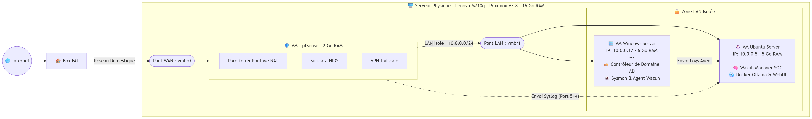
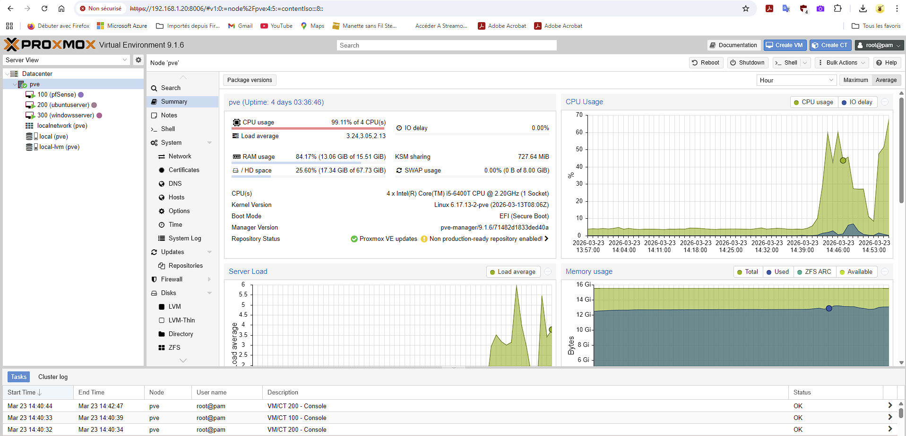
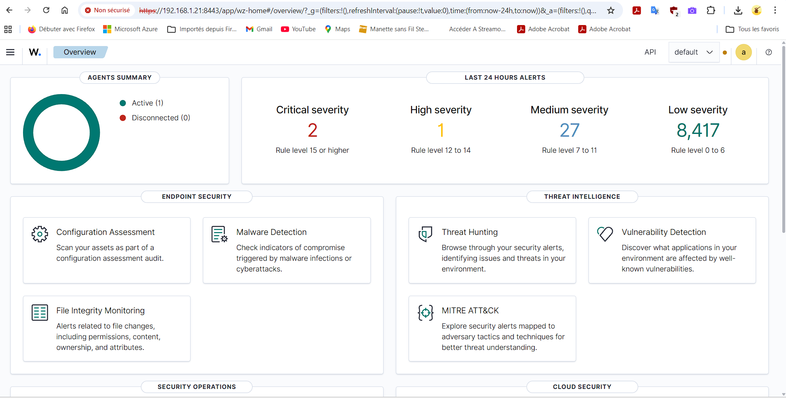

# 🛡️ Home Lab SOC & AI - Edition Mini-PC

Un laboratoire de cybersécurité complet (Security Operations Center) construit sur un environnement matériel restreint (Mini-PC). Ce projet démontre la mise en place d'une architecture réseau segmentée, le déploiement d'un SIEM/XDR couplé à un NIDS, et l'intégration d'une Intelligence Artificielle locale (LLM), le tout optimisé pour une consommation mémoire de 16 Go.

---

## 💻 Environnement Matériel

Le défi principal de ce projet a été d'optimiser l'allocation des ressources pour faire tourner de multiples services de sécurité lourds sur une seule machine compacte.

* **Modèle :** Lenovo ThinkCentre M710q
* **Mémoire (RAM) :** 16 Go
* **Stockage :** 256 Go SSD
* **Hyperviseur :** Proxmox VE 8

---

## 🏗️ Architecture et Topologie Réseau

Pour isoler le laboratoire du réseau domestique, deux commutateurs virtuels (Linux Bridges) ont été configurés dans Proxmox :
* `vmbr0` : Relié physiquement à la box internet (Zone WAN).
* `vmbr1` : Réseau virtuel totalement isolé (Zone LAN).

**Schéma de flux :**
> Internet ➡️ Box ➡️ Proxmox (vmbr0) ➡️ **pfSense (Firewall + NIDS)** ➡️ Réseau Isolé (vmbr1 - 10.0.0.0/24) ➡️ Serveurs Cibles

Toutes les machines du LAN accèdent à internet via pfSense. L'accès depuis l'extérieur vers les machines du LAN est strictement contrôlé par des règles de redirection de ports (NAT) sur des ports non-standards.

---

## 🖥️ Parc de Machines Virtuelles (VM) 

| Machine | OS | RAM | IP (LAN) | Rôles & Services déployés |
| :--- | :--- | :--- | :--- | :--- |
| **Routeur/FW** | pfSense CE | 2 Go | 10.0.0.1 | Pare-feu, NAT, VPN Tailscale, **Suricata (NIDS)**, Forwarding Syslog |
| **Serveur SOC** | Ubuntu Server 24.04 | 5 Go | 10.0.0.5 | Wazuh Manager (SIEM), Docker, Ollama (LLM), Open WebUI |
| **Cible (Endpoint)** | Windows Server | 6 Go | 10.0.0.12 | Machine cible, Sysmon (SwiftOnSecurity), Agent Wazuh, RDP |

*(Note : Environ 3 Go de RAM sont réservés à l'hyperviseur Proxmox).*

---

## 🛠️ Déploiements et Technologies Clés

### 1. Sécurité Périmétrique et NIDS (pfSense & Suricata)
* Déploiement en tant que passerelle unique pour le sous-réseau `10.0.0.0/24`.
* **Suricata (Network Intrusion Detection System) :** Déployé sur l'interface LAN pour analyser le trafic interne/externe en temps réel. Règles "ET Open" optimisées pour la mémoire (focus sur Malwares, Trojans, Exploits et Scans).
* **Centralisation Syslog :** Configuration de pfSense pour transférer l'intégralité de ses journaux (incluant les alertes Suricata) vers le serveur SOC Wazuh via le port UDP 514.

### 2. Security Operations Center (Wazuh & Sysmon)
* **Wazuh Manager :** Installé sur Ubuntu Server pour collecter, indexer et corréler les événements de sécurité (Système + Réseau).
* **Wazuh Agent :** Déployé sur Windows Server.
* **Sysmon :** Déployé sur Windows avec la configuration durcie de *SwiftOnSecurity* pour remonter la création de processus furtifs (`Living off the Land`, ex: abus de `certutil`), les requêtes réseau et les modifications de registre.
* **Vulnerability Detector :** Intégration des bases NVD mondiales pour un audit proactif et continu des failles (CVE) sur les endpoints.

### 3. Intelligence Artificielle Locale (Docker)
* Mise en place d'un environnement IA 100% local et déconnecté d'internet pour l'assistance à l'analyse de logs et de requêtes.
* Déploiement via `docker-compose` de **Ollama** (moteur LLM exécuté sur CPU) et de **Open WebUI** (interface conversationnelle). Modèles utilisés : *Phi-3 / TinyLlama*.

### 4. Accès Distant Sécurisé (Zero Trust)
* Installation du VPN **Tailscale** (basé sur WireGuard) directement sur pfSense en annonçant la route du sous-réseau (`10.0.0.0/24`).
* Installation de Tailscale sur l'hôte Proxmox (Out-of-Band Management) pour garantir un accès de secours à l'hyperviseur en cas de crash de la VM pfSense.

---

## 🎯 Compétences Démontrées

* **Administration Système & Réseau :** Proxmox, Routage, NAT, Linux CLI, PowerShell.
* **Ingénierie SOC & Blue Team :** Déploiement d'un SIEM (Wazuh), centralisation Syslog, corrélation d'événements.
* **Analyse de trafic & HIDS/NIDS :** Configuration de Suricata (NIDS) et Sysmon (HIDS) pour détecter les menaces avancées et les comportements suspects de type Living off the Land.
* **Conteneurisation :** Déploiement de stacks applicatives via Docker et Docker Compose.
* **Sécurité des accès :** Implémentation d'un accès VPN (Zero Trust) sans ouverture de ports sur le routeur FAI.

---
*Note de sécurité : Toutes les adresses IP publiques, mots de passe et clés d'authentification ont été volontairement exclus de ce dépôt.*
